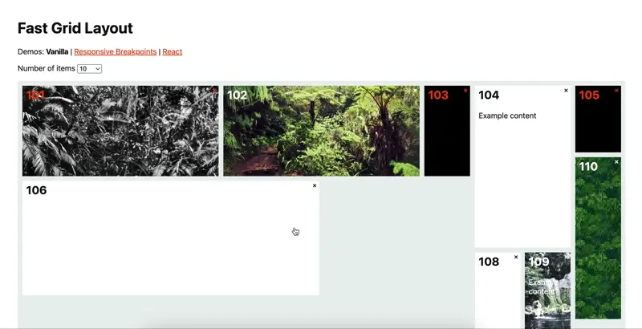
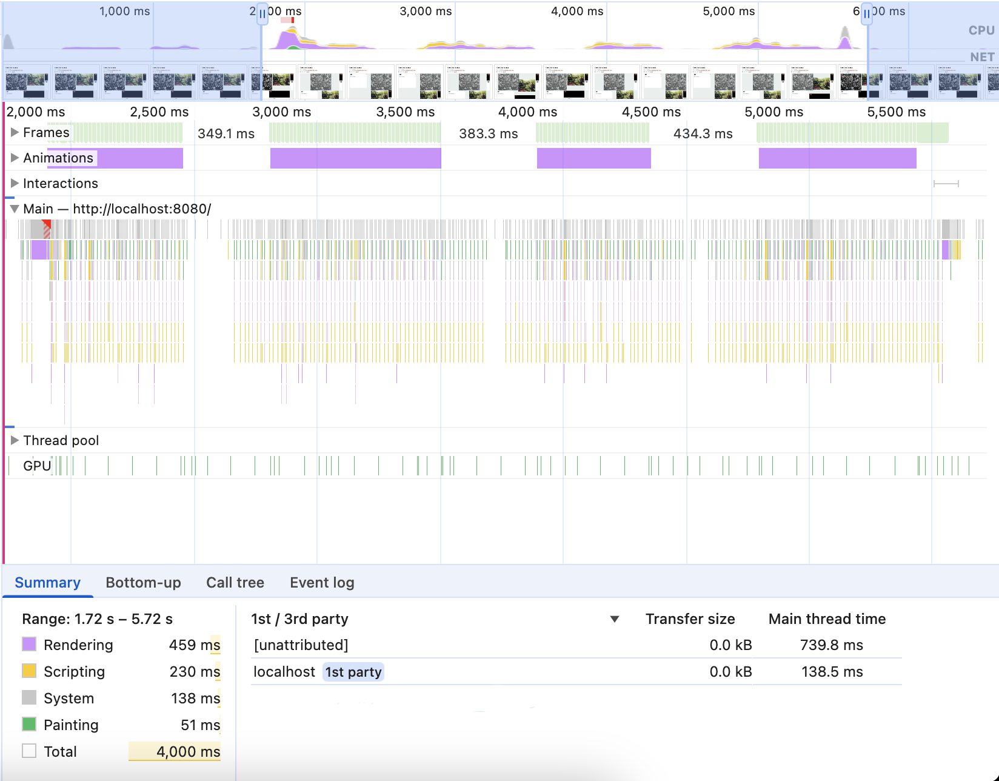
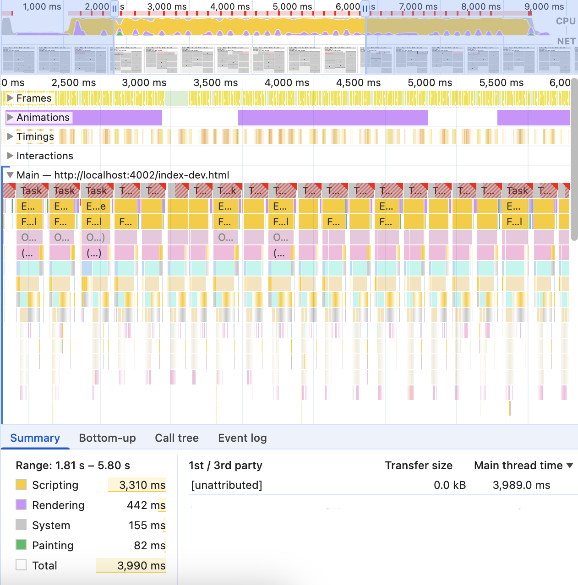

# Fast Grid Layout

Fast editable grid layout system similar to
[React Grid Layout](https://github.com/react-grid-layout/react-grid-layout).
Performant even at **hundreds of items**. Vanilla/framework-agnostic.



- Multi-item drag and drop
- Robust, deterministic manipulation (less accidents)
- Touch support (tap to select, then manipulate)
- Responsive breakpoints with auto-generation
- Data format compatible with
  [React Grid Layout](https://github.com/react-grid-layout/react-grid-layout).
- 4 KB (minimized & gzipped)

Try the **[Demo (Vanilla)](https://morris.github.io/fast-grid-layout/) |
[Demo (with Breakpoints)](https://morris.github.io/fast-grid-layout/react.html)
| [Demo (React)](https://morris.github.io/fast-grid-layout/react.html)**

## Installation

With npm:

```sh
npm install fast-grid-layout
```

Via CDN:

```html
<link
  href="https://cdn.jsdelivr.net/npm/fast-grid-layout@0.1/dist/fast-grid-layout.min.css"
  rel="stylesheet"
/>
<script type="module">
  import { GridLayout } from 'https://cdn.jsdelivr.net/npm/fast-grid-layout@0.1/dist/fast-grid-layout.min.js';
</script>
```

## Usage

Include, copy, and/or customize the [CSS](./dist/fast-grid-layout.css) |
[SCSS](./src/fast-grid-layout.scss) |
[minified CSS](./dist/fast-grid-layout.min.css).

### Vanilla

```html
<div id="#layout">
  <div data-key="a">A</div>
  <div data-key="b">B</div>
  <div data-key="c">C</div>
</div>

<script type="module">
  import { GridLayout } from 'https://cdn.jsdelivr.net/npm/fast-grid-layout@0.1/dist/fast-grid-layout.min.js';

  const container = document.getElementById('layout');

  const config = {
    columns: 12,
    rowHeight: 40,
    gap: 10,
  };

  // Format compatible with React Grid Layout.
  const layout = [
    { x: 0, y: 0, w: 3, h: 3, i: 'a' },
    { x: 3, y: 0, w: 6, h: 3, i: 'b' },
    { x: 3, y: 3, w: 3, h: 2, i: 'c' },
  ];

  const gridLayout = new GridLayout(container, config);
  gridLayout.setLayout(layout);
  gridLayout.setEditable(true);
</script>
```

### React

You'll need a thin wrapper component, for example:

```js
import { useEffect, useRef } from 'react';
import { GridLayout as GridLayoutController } from 'fast-grid-layout';

function GridLayout({ config, layout, editable, onLayoutChange, children }) {
  const containerRef = useRef(null);
  const controllerRef = useRef(null);

  useEffect(() => {
    if (!containerRef.current) return;

    const controller = new GridLayoutController(containerRef.current, config);
    controllerRef.current = controller;

    return () => controller.disconnect();
  }, []);

  useEffect(() => {
    const controller = controllerRef.current;

    if (!controller) return;

    controller.setConfig(config);
    controller.setEditable(editable);
    controller.setLayout(layout);
    controller.onLayoutChange(onLayoutChange);
  }, [config, editable, layout, onLayoutChange, children]);

  return <div ref={containerRef}>{children}</div>;
}
```

The component can be used like this (note the extra `data-key`):

```js
function App() {
  const config = {
    columns: 12,
    rowHeight: 40,
    gap: 10,
  };

  // Format compatible with React Grid Layout.
  const layout = [
    { x: 0, y: 0, w: 3, h: 3, i: 'a' },
    { x: 3, y: 0, w: 6, h: 3, i: 'b' },
    { x: 3, y: 3, w: 3, h: 2, i: 'c' },
  ];

  return (
    <div>
      <h1>Fast Grid Layout (React)</h1>
      <GridLayout config={config} layout={layout} editable>
        {layout.map((item) => (
          <div key={item.i} data-key={item.i}>
            {item.i.toUpperCase()}
          </div>
        ))}
      </GridLayout>
    </div>
  );
}
```

## Configuration

```js
const gridLayout = new GridLayout(container, {
  columns: 12 // Number of columns in the grid (default: 12).
  rowHeight: 30, // Height of each row in pixels (default: 30).
  gap: 0, // Gap between grid cells (applies to both rows and columns, default: 0).
  columnGap: 0, // Horizontal gap between grid columns in pixels (default: gap).
  rowGap: 0, // Vertical gap between grid rows in pixels (default: gap).
  breakpoints: { // Named breakpoint configurations.
    sm: {
      maxWidth: 640, // Maximum container width for this breakpoint.
      columns: 6, // Each breakpoint may override columns, gaps, etc.
    },
    md: {
      maxWidth: 1024,
      columns: 8
    },
    // Largest breakpoint "default" is implicitly defined (maxWidth: Infinity).
  }
});

// Set config dynamically.
gridLayout.setConfig({ /* See above. */ });

// Toggle editing (default: off)
gridLayout.setEditable(true);

// Set layout change callback (there can only be one).
gridLayout.onLayoutChange((layout, breakpoint) => {
  // Handle layout change.
  // Second argument is the breakpoint name for which the layout was changed.
});

// Set selection change callback (there can only be one).
gridLayout.onSelectionChange((selection) => {
  // Handle selection change.
});
```

## Performance

FGL's scripting overhead is negligible, so performance is only limited by the
work the browser needs to do (animations in particular). For example, here's a
profile of 4 seconds of dragging 1 item in a 1000 item layout with FGL:



For comparison, here's a profile of 4 seconds of dragging 1 item in a 1000 item
layout with RGL (scripting overhead is blocking the main thread entirely):



## Notes

- Do not modify layout arrays or items in-place (always make copies). FGL treats
  layouts as immutable and may cache based on object identity.
- Set the `content` class on content elements inside items. This disables item
  selection and dragging when clicking/tapping these elements, but enables text
  selection and other standard browser behavior.
- You may further customize FGL by extending the `GridLayout` class and
  overriding methods and static functions. However, only the public interface of
  `GridLayout` should be considered stable (semantic versioning).

## Contributing

Issues and PRs welcome!

## TODO

- Test more browser/OS combinations
- Describe/streamline server-side rendering
- Document CSS classes
